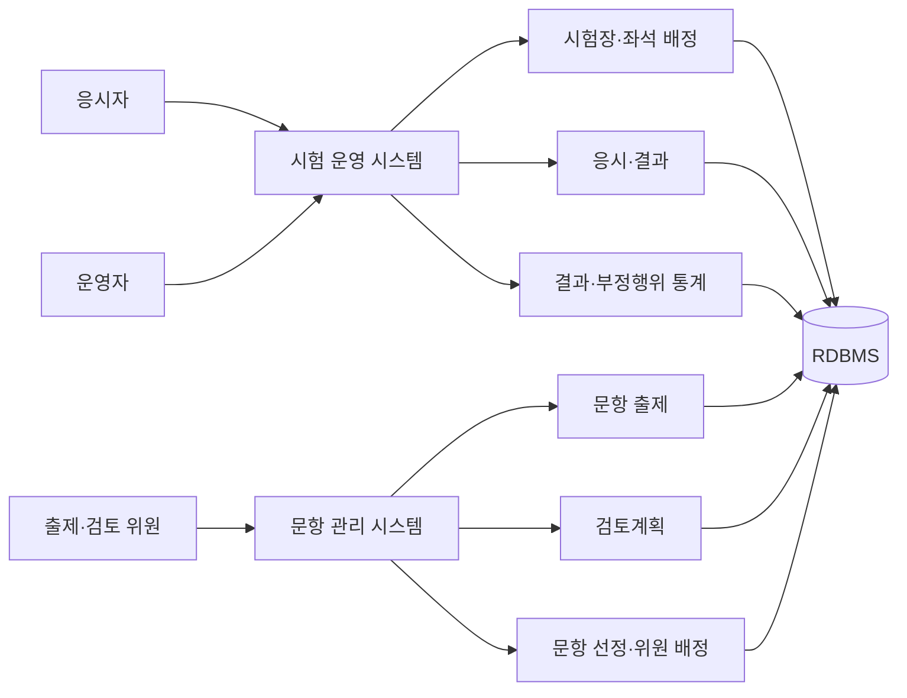

# 온라인 시험 및 문항 관리 플랫폼

시험 접수 이후 시험장·좌석 배정, 응시, 결과 확인까지의 운영 과정과 문항 출제·검토·선정 과정을 함께 관리하는 웹 플랫폼입니다.

온라인 시험 운영 시스템과 문항 관리 시스템의 기능 개발에 참여했습니다. 시험 결과·부정행위 통계, 응시 결과 조회, 문항 검토계획, 선정위원 배정 기능을 주로 담당했습니다.

## 시스템 구성

## 내가 개발한 기능

### 시험 결과 통계

시험 정보와 응시자별 결과를 조회하고, 운영자가 결시 상태를 확정하거나 취소하는 기능을 개발했습니다. 화면에서 수정한 결과를 목록 단위로 저장하고 동일 조건으로 엑셀 자료를 생성하도록 구성했습니다.

### 부정행위 통계

부정행위 의심 건의 유형별 건수와 상세 목록을 분리해 조회했습니다. 운영자가 의심 유형과 내용을 수정한 뒤 판정을 확정하거나 다시 취소할 수 있도록 처리했습니다.

### 응시자 시험 조회

로그인 사용자의 자격 종목과 시험 목록을 조회하고 시험별 접수 정보, 응시 결과, 환불 및 추가 서류 요청을 처리했습니다.

### 문항 검토계획

검토계획에 분야, 문항 유형, 대상 문항을 연결했습니다. 기존 구성을 일부만 수정하지 않고 요청 데이터를 검증한 뒤 분야·유형·문항 구성을 한 번에 교체하도록 구현했습니다.

### 선정위원 배정

선정위원에게 문항을 수동·자동·엑셀 방식으로 배정했습니다. 이미 존재하는 배정은 수정하고 신규 배정은 추가했으며, 자동 배정 시 위원별 담당 건수가 한쪽으로 몰리지 않도록 분배했습니다.

### 문항 통계

문항별 사용 이력과 사용 통계를 조회하고 출제·검토·선정 단계에서 사용할 수 있는 관리 화면을 개발했습니다.

## 구현 사례

실제 담당 기능의 처리 방식을 공개 가능한 Java 17 코드로 다시 작성했습니다. 원본 클래스와 쿼리는 사용하지 않았습니다.

| 담당 기능 | 구현 방식 | 코드 |
|---|---|---|
| 시험 진행과 답안 저장 | 상태 전이 검증, 제출 ID 기반 중복 방지 | [ExamSession](samples/exam-workflow/src/main/java/com/portfolio/exam/ExamSession.java) |
| 검토계획 저장 | 분야·문항 전체 검증 후 한 번에 교체 | [ReviewPlanService](samples/exam-workflow/src/main/java/com/portfolio/exam/review/ReviewPlanService.java) |
| 선정위원 자동 배정 | 현재 배정 수를 기준으로 균등 분배, 문항 중복 차단 | [ReviewerAssignmentService](samples/exam-workflow/src/main/java/com/portfolio/exam/assignment/ReviewerAssignmentService.java) |

처리 순서와 구현 판단은 [구현 상세](docs/IMPLEMENTATION.md)에 정리했습니다.

## 기술 구성

| 구분 | 사용 기술 | 적용 영역 |
|---|---|---|
| Backend | Java, Spring MVC, 전자정부표준프레임워크 | 시험·문항 업무 로직과 웹 요청 처리 |
| Data Access | MyBatis | 복합 조회와 통계 쿼리 구성 |
| Database | Oracle, MariaDB/MySQL 계열 | 시험 운영 및 문항 데이터 저장 |
| View | JSP, JavaScript | 관리자와 응시자 화면 |
| Document | Apache POI, JXLS | 통계와 배정 자료 처리 |
| Build | Maven | 의존성 및 배포 산출물 관리 |

## 관련 문서

- [담당 업무와 기여 내용](docs/CONTRIBUTIONS.md)
- [구현 상세](docs/IMPLEMENTATION.md)
- [설계하면서 확인한 점](docs/TECHNICAL-NOTES.md)
- [샘플 실행 방법](samples/exam-workflow/README.md)

회사 소스, 고객사명, 운영 데이터와 내부 설정은 포함하지 않았습니다. 샘플 코드는 담당 업무의 핵심 흐름을 설명하기 위해 별도로 작성했습니다.

