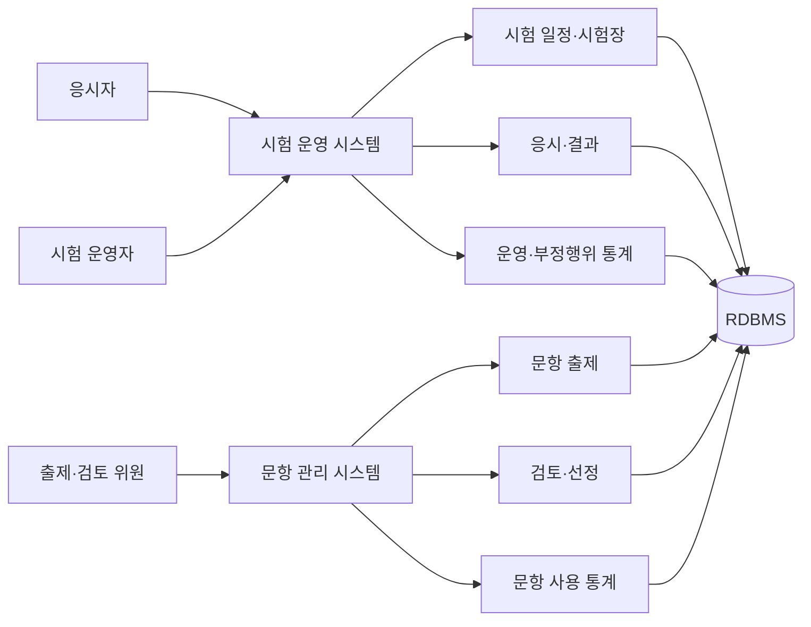

# 온라인 시험 및 문항 관리 플랫폼

시험 접수 이후 시험장·좌석 배정, 응시, 결과 확인까지의 운영 과정과 문항 출제·검토·선정 과정을 함께 관리하는 웹 플랫폼입니다.

온라인 시험 운영 시스템과 문항 관리 시스템의 유지보수 및 기능 개발에 참여했습니다. 시험 운영 통계, 부정행위 통계, 응시 결과 조회와 문항 출제 계획, 검토 계획, 선정위원 배정 기능을 주로 담당했습니다.

## 프로젝트에서 다룬 문제

시험 운영 데이터는 접수자, 시험 일정, 시험장, 좌석, 응시 결과처럼 서로 연결된 정보가 많습니다. 문항 역시 출제 요청부터 검토, 선정, 실제 시험 사용까지 단계별 이력이 필요합니다.

두 시스템의 역할을 분리하되 시험 계획과 문항 사용 결과가 이어지도록 구성했습니다.

- 시험 운영 시스템: 응시자와 시험 일정, 시험장 배정, 결과 및 통계 관리
- 문항 관리 시스템: 출제·검토 계획, 위원 배정, 문항 선정, 사용 통계 관리

## 전체 구조

## 담당한 작업

### 시험 운영과 결과 조회

- 시험계획과 시험실 운영 정보 조회
- 응시자의 시험 목록 및 결과 확인 기능
- 시험장·좌석·수험번호 배정 상태 관리
- 시험 결과 및 부정행위 의심 통계 화면 개발
- 접수 현황과 자격 확인 통계 자료 구성
- 엑셀 기반 통계 자료 생성

### 문항 출제와 검토

- 출제 계획과 검토 계획 등록·조회
- 분야별 문항 수와 문항 유형 관리
- 출제·검토 위원 배정
- 검토 요청과 첨부파일 관리
- 문항 선정 현황 및 통계 조회
- 문항 사용 이력과 사용 통계 관리

### 공통 관리 기능

- 관리자, 메뉴, 코드 관리 기능
- 화면과 서비스 계층의 유효성 검사
- MyBatis Mapper 쿼리 작성 및 수정
- 시스템 처리 이력 조회

## 기술 구성

| 구분 | 사용 기술 | 적용 영역 |
|---|---|---|
| Backend | Java, Spring MVC, 전자정부표준프레임워크 | 시험·문항 업무 로직과 웹 요청 처리 |
| Data Access | MyBatis | 복합 조회와 통계 쿼리 구성 |
| Database | Oracle, MariaDB/MySQL 계열 | 시험 운영 및 문항 데이터 저장 |
| View | JSP, JavaScript | 관리자와 응시자 화면 |
| Document | Apache POI, JXLS | 통계 및 운영 자료 다운로드 |
| Build | Maven | 의존성 및 배포 산출물 관리 |

## 작업하면서 중요하게 본 부분

- 시험계획, 시험장, 응시자 사이의 연결 관계가 깨지지 않도록 배정 전후 조건을 확인했습니다.
- 단순 목록과 통계 조회를 분리해 집계 쿼리가 일반 화면의 응답에 영향을 주지 않도록 관리했습니다.
- 문항은 출제·검토·선정 단계에 따라 수정 가능한 범위가 달라지므로 현재 단계 검증을 서비스 계층에 두었습니다.
- 운영자가 엑셀 자료와 화면의 수치를 비교할 수 있도록 동일한 조회 조건을 사용했습니다.

상세 담당 내용은 [기여 내역](docs/CONTRIBUTIONS.md), 설계 과정에서 확인한 내용은 [기술 노트](docs/TECHNICAL-NOTES.md)에 정리했습니다.

## 샘플 코드

- [시험 진행 상태 관리 샘플](samples/exam-workflow): 시험 시작, 답안 제출, 종료 과정의 상태 전이와 중복 제출 처리를 Java 17로 재구성했습니다.

회사 소스, 고객사명, 운영 데이터와 내부 설정은 포함하지 않았습니다. 샘플 코드는 담당 업무의 핵심 흐름을 설명하기 위해 별도로 작성했습니다.

